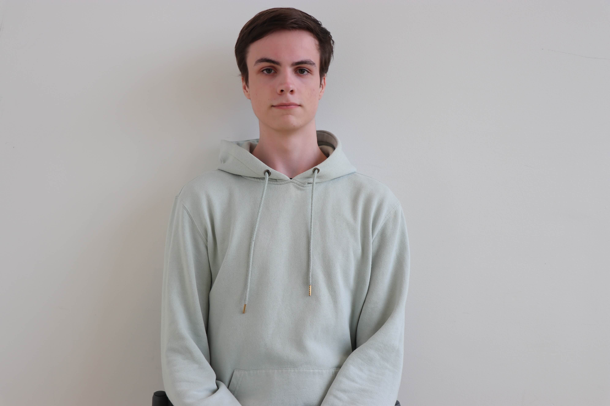

# Squad Page 1J

## Inhoudsopgave
- [Beschrijving](#beschrijving)
- [Gebruik](#gebruik)
- [Kenmerken](#kenmerken)
- [Over ons](#over-ons)
- [Bronnen](#bronnen)
- [Licentie](#licentie)
  
## Beschrijving
Ons project geeft een overzicht van de medestudenten van onze squad (klas) en laat locaties op de Amstelcampus zien. 
Met behulp van de foto's kun je de GitHub-pagina's en de visitekaartjes van de desbetreffende persoon bezoeken.

De pagina is responsive en is Mobile first ontworpen en gemaakt.

#### 3 leuke dingen over onze site:
- de carouselfunctie die de foto’s van onze medestudenten laat zien
- de knoppen op de header die een animatie hebben
- de responsiveness van de site voor telefoongebruik

Hier staat de website: https://edu.nl/7wnje 

## Gebruik

De header heeft een blijvende navigatiebalk waardoor je op elk moment naar verschillende onderdelen van onze website kunt gaan.

### Squad Page 1J
In het onderdeel 'squad page 1j' staan de foto's van de studenten uit onze squad(klas) met de namen er onder. Door te klikken op een foto in het carousel, kom je op de GitHub-pagina van de desbeetreffende persoon. 

### Visitekaartjes
In het onderdeel 'Visitekaartjes' staan screenshots van de visitekaartjes van de studenten uit onze squad(klas). Door te klikken op de foto's van de visitekaartjes wordt je doorgestuurd naar de webpagina van het visitekaartje van de desbetreffende persoon. 

### Amstelcampus
In het onderdeel 'Amstelcampus' staan foto's die wij hebben gemaakt van verschillende locaties binnen de HvA. Waar je mogelijk zou kunnen studeren of eten. 


## Kenmerken
De website is gebouwd met HTML en CSS.

### HTML
Hieronder staat de basis structuur uitgelegd met de setting in de HEAD en opmaak van de BODY:

#### Head
In de `<head>` wordt een CSS file geladen. De styling van de HTML wordt via de CSS file bepaald.


```HTML
<link rel="stylesheet" href="styles/style.css">
```

In de head wordt ook een extern font geladen: De Roboto

```HTML
<link rel="preconnect" href="https://fonts.googleapis.com">
```

### Body
De structuur van de body is [HEADER](#header), [MAIN](#main) en [FOOTER](#footer):

#### Header
In de header staat de navigatiebalk met links naar verschillende onderdelen van onze website.

#### Main
In de main staan 3 secties. De sectie 'squad page 1j' met een id, de sectie 'visitekaartjes' met een id en de sectie 'amstelcampus' met een id. De id's worden gebruikt om vanuit de navigatiebalk te linken.

```HTML
<section id="squad-page-1j">

<section id="visitekaartjes">

<section id="amstelcampus">
```

Er worden verschillende HTML-elementen gebruikt om de opmaak te kunnen aanpassen, waaronder het 'div-element'.

```HTML
<div class="profile">
  <h3>Maarten</h3>
  <div><a href="https://github.com/MaartentePoele" target="_blank"></a></div>
</div>
```

#### Footer
In de `<footer>` staan de namen van de teamleden die deze website hebben gemaakt. 

### CSS
In de CSS staat een `scroll-behavior: smooth;` op de HTML voor een animatie als iemand op de links in de navigatiebalk klikt.

## Over ons
Wij zijn [Maarten](https://github.com/MaartentePoele), [Kevin](https://github.com/toasterbath0758) en [Sieuwke](https://github.com/SieuwkeSheta). 3 Eerste jaars studenten, uit klas 1J, van de HvA op de opleiding Frontend and Development. Ons team heet 'De Drie Musketier'.

Gebruikers kunnen informatie krijgen over onze website door één van ons aan te spreken of te berichten.

## Bronnen
- [HTML elements reference](https://developer.mozilla.org/en-US/docs/Web/HTML/Reference/Elements)

- [CSS reference](https://developer.mozilla.org/en-US/docs/Web/CSS/Reference)

- [CSS Grid reference](https://css-tricks.com/snippets/css/complete-guide-grid/)

- [Beginner guide to Media Queries @ MDN](https://developer.mozilla.org/en-US/docs/Learn_web_development/Core/CSS_layout/Media_queries)

- [A Complete Guide to CSS Media Queries @ CSS Tricks](https://css-tricks.com/a-complete-guide-to-css-media-queries/)

- [Video naar het maken van automatische sliders in CSS](https://www.youtube.com/watch?v=3Z780EOzIQs&t=67s&ab_channel=TheMuteDev)

## Licentie

This project is licensed under the terms of the [MIT license](./LICENSE).


